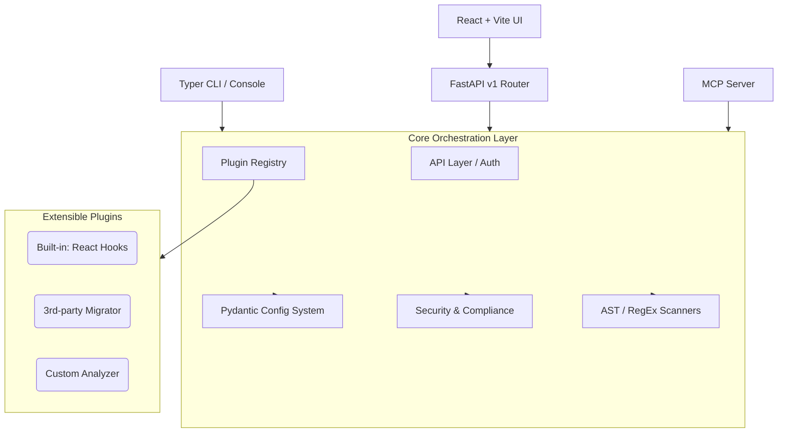

# Code Migration Assistant: System Architecture

The Code Migration Assistant is designed to be an enterprise-grade platform capable of running locally or deployed within strict, air-gapped security environments. It enforces static analysis over dynamic execution, uses strong structured data models, and is endlessly extensible through a robust Plugin Registry.

## High-Level Components

## 1. Plugin Architecture (Python `entry_points`)
The heart of the application is the `MigratorRegistry` (`src/code_migration/registry.py`). Instead of hardcoded class mappings, the registry reads dynamically installed plugins through Python's built-in `importlib.metadata.entry_points`.

- **Namespace**: `code_migration.migrators`
- **Interface**: Any package can expose a class subclassing `BaseMigrator`. The registry extracts metadata (`version`, `tags`, `supported_extensions`) dynamically and registers it into the system.

## 2. Configuration System
The `code_migration.config` module uses Pydantic's `BaseSettings` for a robust, multi-tier hierarchy:
1. `config.defaults.yaml` (Base defaults)
2. `.env` files (Local developer overrides)
3. Direct Environment Variables (CI/CD / Production overrides) ex: `MIGRATION_SERVER__PORT`

This unified state replaces distributed hardcoded constraints throughout the app.

## 3. Compliance and Security 
No arbitrary code is ever `eval()`'d or executed.
- **`code_sandbox.py`**: Ensures files do not exceed sizes, line counts, or cyclomatic limits via standard library AST parsing.
- **`audit_logger.py`**: Binds to `structlog` to emit standard JSON but explicitly manages its own 50MB rotating file append log (`security_audit.jsonl`) for SOC2/GDPR adherence without affecting user console noise.
- **`pii_detector.py` / `anonymizer.py`**: Ensures pre-flight and post-flight sanitization of user strings.

## 4. API Layer (FastAPI)
Located at `src/code_migration/api/`:
- **`v1/router.py`**: Serves streaming Server-Sent Events (SSE) for heavy code modification tasks.
- **`auth.py`**: Defies `X-API-Key` intercept layer bound to `config.settings`.
- **`schemas.py`**: Pydantic models force OpenAPI documentation consistency.
- **`errors.py`**: Traps exceptions natively, transforming standard outputs to JSON representations like `{"error": {"code": "SECURITY_VIOLATION", "message": "..."}}`.

## 5. Observability (Structlog)
The global logger `code_migration.utils.logger` uses localized context binding:
- By default acts as pretty console logger.
- When `MIGRATION_OBSERVABILITY__LOG_FORMAT=json` is found, automatically wraps output into standardized contextual JSON packets for elastic sinks (Datadog/ELK).
